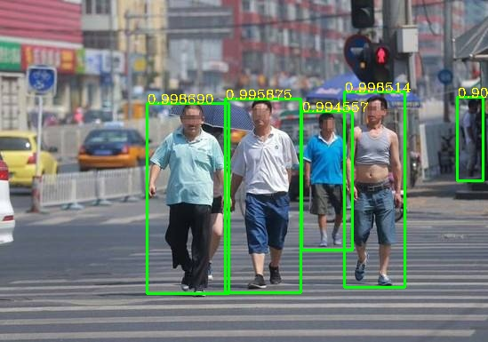
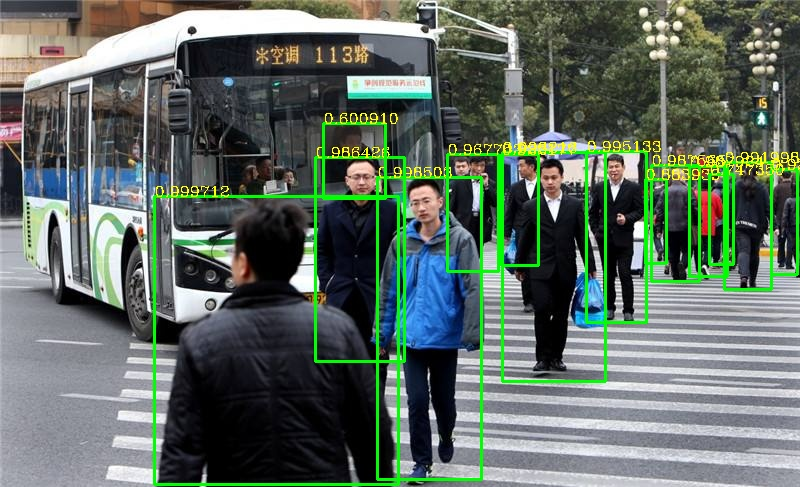
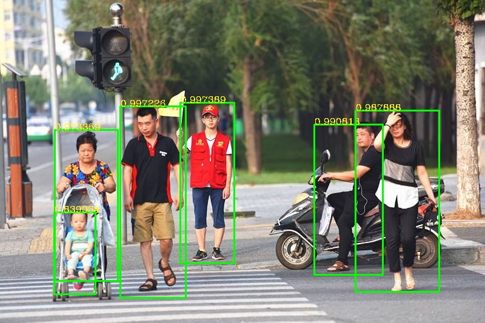

# Amazing_Person_Detection_V2
CPU Real-time Amazing Person Detection V2
# FIND CODE  
https://blog.csdn.net/samylee/article/details/112837675  
# Test steps
Download 'third_part dll' and put it to current directory. [BaiDu Cloud](https://pan.baidu.com/s/1X9-pDypbj-TJMFxiSqow9A) Password: 4wpj  
# Algorithm efficiency
| Algorithm | min_size | COCO2014-AP | CPU(i7-9700K @3.6GHz) Speed/FPS |
|:------:|:------:|:------:|:------:|
| YOLO-V3-416x416  | 12x12 | 0.5729(thresh-0.5, IOU-0.5) |526ms/1.9|
| ours  | 12x12 | 0.5712(thresh-0.6, IOU-0.5) |14ms/71.4|
# Example result

# Reference
https://blog.csdn.net/samylee
